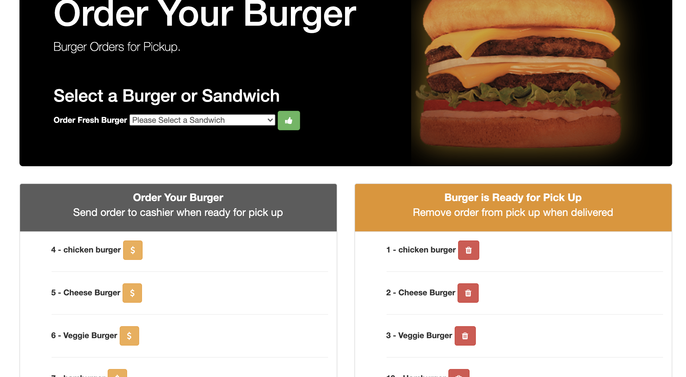

# The Burger App
# undefined
# Welcome to undefined: 
## Description
A Burger app that will allow the user to order a burger once burger is ready for pick up. The burger will appear in the "ready for pick up section" once it is ready using the database "mySQL". which will say it has been "devoured".
## Table of Contents
Navigate through the README Using the Table of Contents : 
* [Installation](#Installation)
* [Usage](#Usage)
* [License](#License)
* [Contributions](#Contributions)
* [Tests](#Tests)
* [Questions](#Questions)
* [Extensions](#Extensions)
## Installation 
This app was app was created using npm, express and handlebars in order to run the app use "npm start" 
## Usage
For fun
## Extensions
Express
Express handle-bars
Mysql
npm init
## License

## Contributors
None
## Badges
## Tests
None
## Questions
[Link to Creator Github](https://github.com/Allielewis07)

